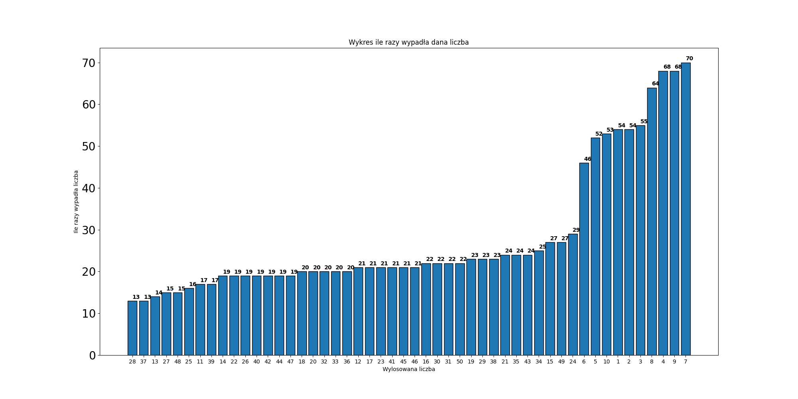
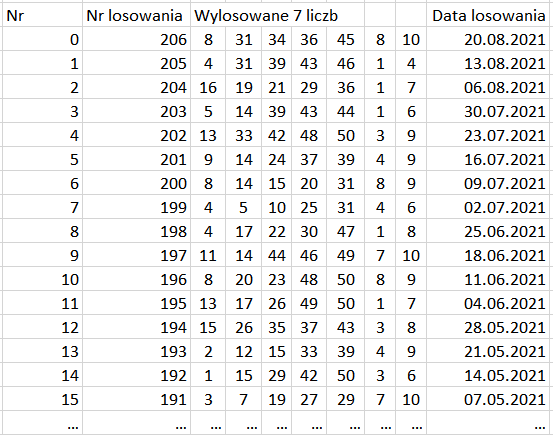

# Scraping_EuroJackPot
Prosty kod do scrapowania strony losowań EuroJackPot. Wykorzystuje Selenium Python API, bibliotekę pandas, numpy i matplotlib.pyplot. Autor zdaje sobie sprawę z przypadkowosci
wylosowanych liczb i niskiego prawdopodobieństwa wygranej, a także nie zachęca do wzorowania się na podstawie tych danych. Jest to tylko dla zabawy.

It's a simple code to scratching the EuroJackPot webiste. It was used Selenium Python API, pandas library, numpy and matplotlib.pyplot libraries. The author is aware of 
the randomness of winning numbers and the low probability of winning, and does not encourage following from these data. This is just for fun.

  

